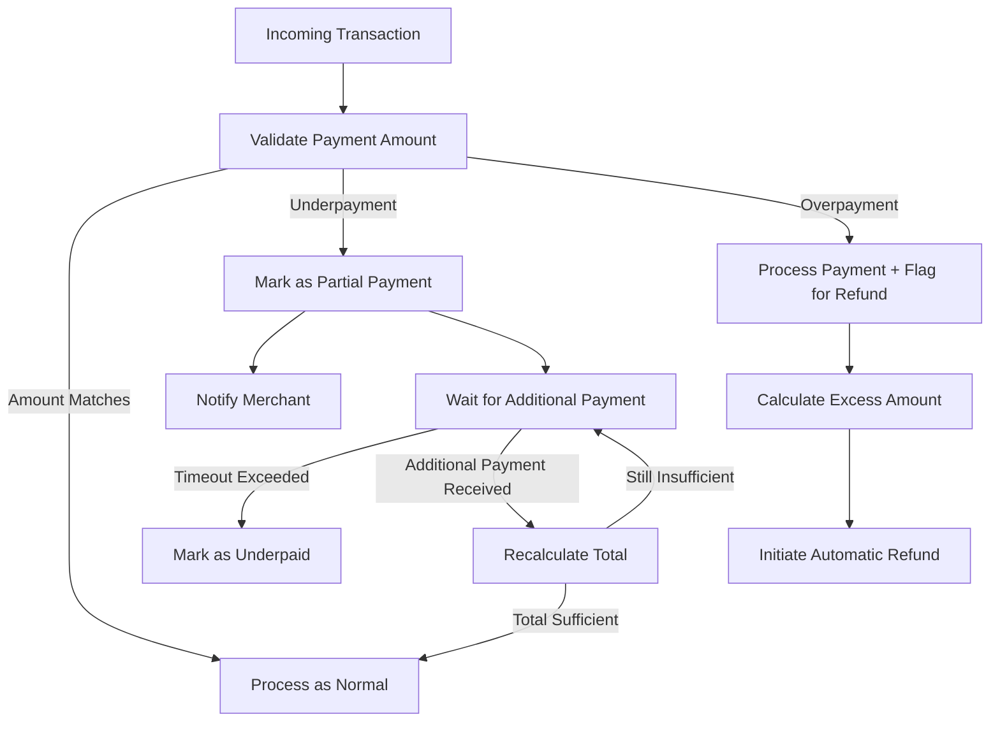
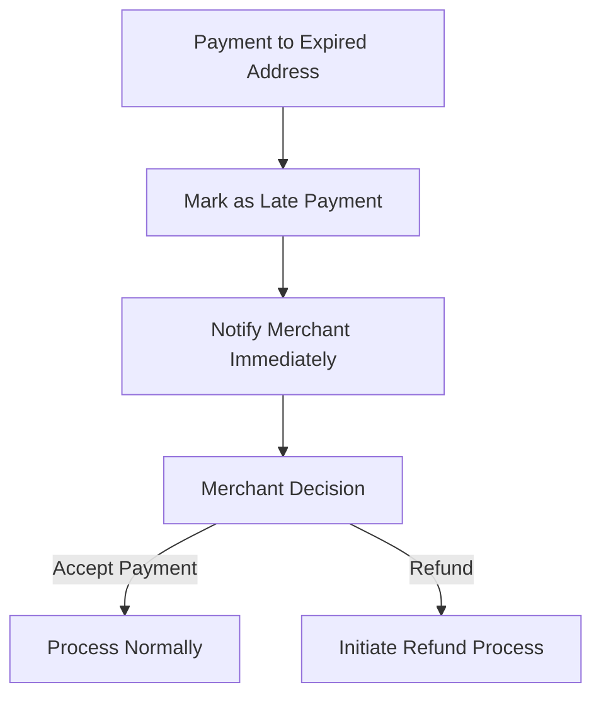

# Alternative Payment Workflows for Error Handling

This document outlines alternative workflows for handling various payment error scenarios in the Crypto Payment Gateway, with a focus on handling incorrect payment amounts and implementing refund mechanisms.

## Current Workflow Analysis

The current payment processing workflow follows these steps:

1. A payment address is generated with an optional `expectedAmount`
2. The system monitors the address for incoming transactions
3. When a transaction is detected, it's processed through `processIncomingTransaction`
4. The transaction goes through confirmation monitoring
5. Once confirmed, funds are settled to a hot wallet

However, the current implementation has gaps in handling several error scenarios:

- **Incorrect payment amounts** (underpayment or overpayment)
- **Payments to expired addresses**
- **Refund mechanisms** for failed or incorrect transactions

## Alternative Workflows

### 1. Handling Incorrect Payment Amounts

#### Current Gap

The system accepts any payment amount without validation against the expected amount. This can lead to issues where merchants receive less than expected or customers overpay.

#### Proposed Solution



**Implementation Steps:**

1. Modify `processIncomingTransaction` in `blockchainService.ts` to validate payment amounts:

```typescript
// Add to processIncomingTransaction method
if (paymentAddress.expectedAmount) {
  // Check for underpayment
  if (amountDecimal < paymentAddress.expectedAmount * 0.99) { // 1% tolerance
    transaction.status = TransactionStatus.PARTIAL;
    // Store the expected amount in metadata for reference
    transaction.metadata = {
      ...transaction.metadata,
      expectedAmount: paymentAddress.expectedAmount,
      amountDifference: paymentAddress.expectedAmount - amountDecimal
    };
    
    // Send webhook notification for partial payment
    await this.webhookService.sendWebhookNotification(
      paymentAddress.merchantId,
      WebhookEvent.PAYMENT_PARTIAL,
      {
        id: savedTx.id,
        txHash,
        amount: amountDecimal,
        expectedAmount: paymentAddress.expectedAmount,
        status: TransactionStatus.PARTIAL
      }
    );
  }
  
  // Check for overpayment
  if (amountDecimal > paymentAddress.expectedAmount * 1.01) { // 1% tolerance
    // Store the excess amount in metadata
    transaction.metadata = {
      ...transaction.metadata,
      expectedAmount: paymentAddress.expectedAmount,
      excessAmount: amountDecimal - paymentAddress.expectedAmount,
      refundPending: true
    };
    
    // Queue a refund task
    await this.queueService.addToQueue('refund.process', {
      transactionId: savedTx.id,
      excessAmount: amountDecimal - paymentAddress.expectedAmount,
      refundAddress: from
    });
  }
}
```

2. Add a new `TransactionStatus` enum value:

```typescript
export enum TransactionStatus {
  // Existing statuses
  PENDING = 'pending',
  CONFIRMING = 'confirming',
  CONFIRMED = 'confirmed',
  FAILED = 'failed',
  EXPIRED = 'expired',
  SETTLED = 'settled',
  // New status
  PARTIAL = 'partial'
}
```

3. Add a new webhook event type:

```typescript
export enum WebhookEvent {
  // Existing events
  PAYMENT_RECEIVED = 'payment.received',
  PAYMENT_CONFIRMED = 'payment.confirmed',
  // New events
  PAYMENT_PARTIAL = 'payment.partial',
  PAYMENT_EXCESS = 'payment.excess',
  REFUND_INITIATED = 'refund.initiated',
  REFUND_COMPLETED = 'refund.completed'
}
```

### 2. Refund Processing Service

Implement a new `RefundService` to handle automatic refunds for overpayments:

```typescript
export class RefundService {
  private blockchainService: BlockchainService;
  private walletService: WalletService;
  private queueService: QueueService;
  private webhookService: WebhookService;
  
  constructor(
    blockchainService: BlockchainService,
    walletService: WalletService,
    queueService: QueueService,
    webhookService: WebhookService
  ) {
    this.blockchainService = blockchainService;
    this.walletService = walletService;
    this.queueService = queueService;
    this.webhookService = webhookService;
  }
  
  async initialize(): Promise<void> {
    // Start consuming from the refund queue
    await this.queueService.consumeQueue('refund.process', this.processRefundTask.bind(this));
  }
  
  private async processRefundTask(data: any): Promise<void> {
    const { transactionId, excessAmount, refundAddress } = data;
    
    try {
      // Get the transaction
      const connection = await getConnection();
      const transactionRepository = connection.getRepository(Transaction);
      const transaction = await transactionRepository.findOne({
        where: { id: transactionId },
        relations: ['paymentAddress']
      });
      
      if (!transaction || !transaction.paymentAddress) {
        throw new Error(`Transaction ${transactionId} not found or has no payment address`);
      }
      
      // Create a refund transaction
      const refundTx = new Transaction();
      refundTx.type = TransactionType.REFUND;
      refundTx.status = TransactionStatus.PENDING;
      refundTx.amount = excessAmount;
      refundTx.currency = transaction.currency;
      refundTx.fromAddress = transaction.toAddress;
      refundTx.toAddress = refundAddress;
      refundTx.merchantId = transaction.merchantId;
      refundTx.metadata = {
        originalTransactionId: transaction.id,
        reason: 'overpayment'
      };
      
      // Save the refund transaction
      const savedRefundTx = await transactionRepository.save(refundTx);
      
      // Get wallet for the payment address
      const wallet = await this.walletService.getWalletForAddress(transaction.paymentAddress.id);
      
      // Send the refund
      const refundResult = await this.sendRefund(wallet, refundAddress, excessAmount, transaction.currency);
      
      // Update the refund transaction
      refundTx.txHash = refundResult.hash;
      await transactionRepository.save(refundTx);
      
      // Update the original transaction metadata
      transaction.metadata = {
        ...transaction.metadata,
        refundPending: false,
        refundCompleted: true,
        refundTransactionId: savedRefundTx.id,
        refundTxHash: refundResult.hash
      };
      await transactionRepository.save(transaction);
      
      // Send webhook notification
      await this.webhookService.sendWebhookNotification(
        transaction.merchantId,
        WebhookEvent.REFUND_COMPLETED,
        {
          id: savedRefundTx.id,
          originalTransactionId: transaction.id,
          txHash: refundResult.hash,
          amount: excessAmount,
          currency: transaction.currency,
          status: TransactionStatus.CONFIRMING
        }
      );
      
      // Queue confirmation monitoring for the refund
      await this.queueService.addToQueue('transaction.monitor', {
        id: savedRefundTx.id,
        type: 'check_confirmations'
      });
    } catch (error) {
      logger.error(`Error processing refund for transaction ${transactionId}: ${error.message}`, { error });
      
      // Retry the refund task with exponential backoff
      const retryCount = data.retryCount || 0;
      if (retryCount < 5) {
        const delay = Math.pow(2, retryCount) * 60000; // Exponential backoff
        setTimeout(async () => {
          await this.queueService.addToQueue('refund.process', {
            ...data,
            retryCount: retryCount + 1
          });
        }, delay);
      } else {
        // After max retries, notify merchant for manual handling
        const connection = await getConnection();
        const transactionRepository = connection.getRepository(Transaction);
        const transaction = await transactionRepository.findOne({
          where: { id: transactionId }
        });
        
        if (transaction) {
          await this.webhookService.sendWebhookNotification(
            transaction.merchantId,
            WebhookEvent.REFUND_FAILED,
            {
              id: transaction.id,
              amount: excessAmount,
              currency: transaction.currency,
              refundAddress,
              error: error.message
            }
          );
        }
      }
    }
  }
  
  private async sendRefund(
    wallet: ethers.Wallet,
    toAddress: string,
    amount: number,
    currency: string
  ): Promise<ethers.providers.TransactionResponse> {
    // For USDT on BSC
    const usdtContract = new ethers.Contract(
      config.blockchain.bscMainnet.contracts.usdt,
      [
        'function transfer(address to, uint256 amount) returns (bool)',
        'function balanceOf(address owner) view returns (uint256)',
        'function decimals() view returns (uint8)'
      ],
      wallet
    );
    
    // Get decimals
    const decimals = await usdtContract.decimals();
    
    // Convert amount to token units
    const amountInTokenUnits = ethers.utils.parseUnits(amount.toString(), decimals);
    
    // Send the transaction
    const tx = await usdtContract.transfer(toAddress, amountInTokenUnits, {
      gasLimit: config.blockchain.bscMainnet.gasLimit,
      gasPrice: ethers.utils.parseUnits(config.blockchain.bscMainnet.gasPrice, 'gwei')
    });
    
    return tx;
  }
}
```

### 3. Handling Payments to Expired Addresses

When a payment is received to an expired address, the system should:

1. Accept the payment but mark it with a special status
2. Notify the merchant immediately
3. Provide options for the merchant to either accept the payment or refund it



**Implementation:**

Modify the `processIncomingTransaction` method to check for expired addresses:

```typescript
// Add to processIncomingTransaction method
if (paymentAddress.status === AddressStatus.EXPIRED) {
  // Mark transaction as late payment
  transaction.metadata = {
    ...transaction.metadata,
    latePayment: true,
    addressExpiredAt: paymentAddress.expiresAt
  };
  
  // Send urgent webhook notification
  await this.webhookService.sendWebhookNotification(
    paymentAddress.merchantId,
    WebhookEvent.PAYMENT_TO_EXPIRED_ADDRESS,
    {
      id: savedTx.id,
      txHash,
      amount: amountDecimal,
      currency: 'USDT',
      status: TransactionStatus.CONFIRMING,
      paymentAddressId: paymentAddress.id,
      addressExpiredAt: paymentAddress.expiresAt,
      timestamp: new Date().toISOString()
    },
    { priority: 'high' } // Add priority flag for urgent notifications
  );
}
```

### 4. Manual Refund API Endpoint

Implement an API endpoint for merchants to manually initiate refunds:

```typescript
/**
 * @route POST /api/v1/transactions/:id/refund
 * @desc Initiate a refund for a transaction
 * @access Private (Merchant)
 */
router.post(
  '/:id/refund',
  merchantAuthMiddleware,
  idempotencyMiddleware,
  [
    body('amount').optional().isFloat({ min: 0.01 }).toFloat(),
    body('refundAddress').optional().isString(),
    body('reason').optional().isString()
  ],
  asyncHandler(async (req: Request, res: Response, next: NextFunction) => {
    const { id } = req.params;
    const { amount, refundAddress, reason } = req.body;
    const merchantId = req.merchant?.id;
    
    if (!merchantId) {
      return next(new ApiError(401, 'Merchant ID is required', true));
    }
    
    try {
      const connection = await getConnection();
      const transactionRepository = connection.getRepository(Transaction);
      
      // Find the transaction
      const transaction = await transactionRepository.findOne({
        where: { id, merchantId },
        relations: ['paymentAddress']
      });
      
      if (!transaction) {
        return next(new ApiError(404, 'Transaction not found', true));
      }
      
      // Validate refund amount
      const refundAmount = amount || transaction.amount;
      if (refundAmount > transaction.amount) {
        return next(new ApiError(400, 'Refund amount cannot exceed original payment amount', true));
      }
      
      // Determine refund address
      const toAddress = refundAddress || transaction.fromAddress;
      if (!toAddress) {
        return next(new ApiError(400, 'Refund address is required', true));
      }
      
      // Queue the refund
      const queueService = new QueueService();
      await queueService.addToQueue('refund.process', {
        transactionId: transaction.id,
        excessAmount: refundAmount,
        refundAddress: toAddress,
        reason: reason || 'merchant_initiated',
        initiatedBy: merchantId
      });
      
      res.status(202).json({
        success: true,
        message: 'Refund initiated',
        data: {
          transactionId: transaction.id,
          refundAmount,
          refundAddress: toAddress,
          status: 'pending'
        }
      });
    } catch (error) {
      next(error);
    }
  })
);
```

## Integration with Existing Workflow

To integrate these alternative workflows with the existing system:

1. Add the new transaction statuses and webhook events
2. Implement the `RefundService` and register it in the application startup
3. Modify the `processIncomingTransaction` method to validate payment amounts
4. Add the manual refund API endpoint
5. Update the webhook documentation to include the new event types

## Monitoring and Reporting

Implement a dashboard for monitoring payment errors and refunds:

1. Track partial payments and their completion status
2. Monitor automatic refunds and their status
3. Generate reports on payment errors by type and merchant
4. Provide alerts for high-value refunds or repeated errors from the same customer

## Conclusion

These alternative workflows address the current gaps in the payment processing system, particularly for handling incorrect payment amounts and implementing refund mechanisms. By implementing these changes, the system will be more robust and provide better handling of edge cases that are common in cryptocurrency payment gateways.