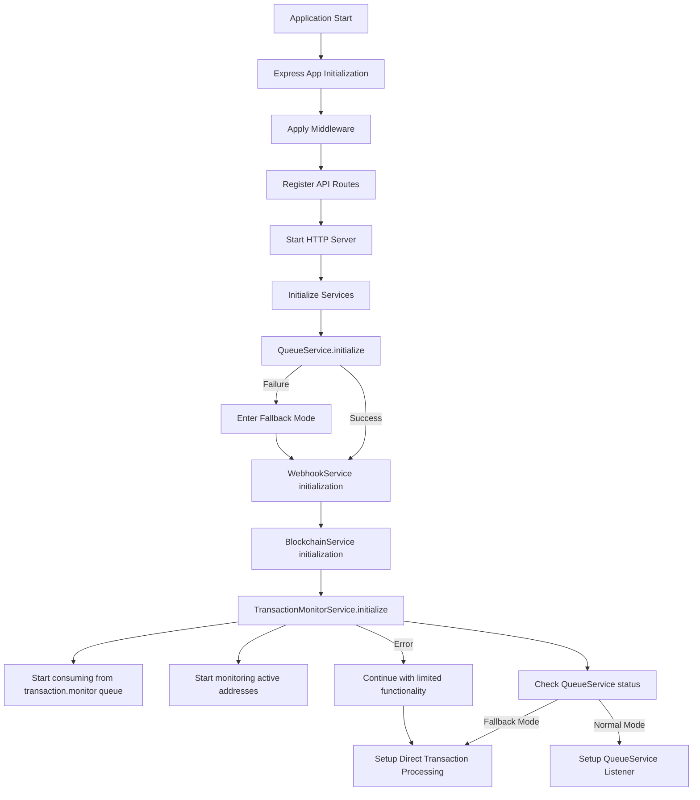
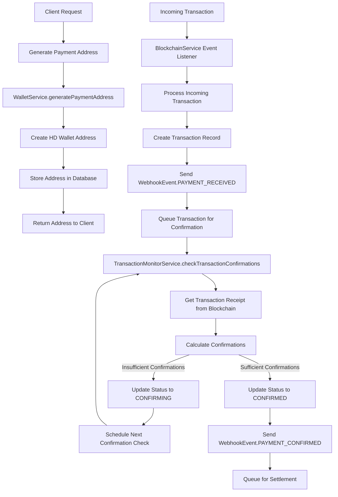
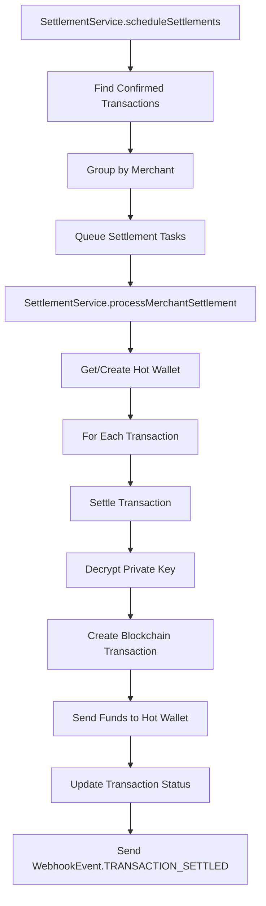
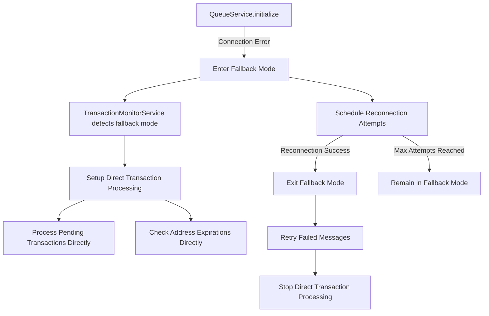
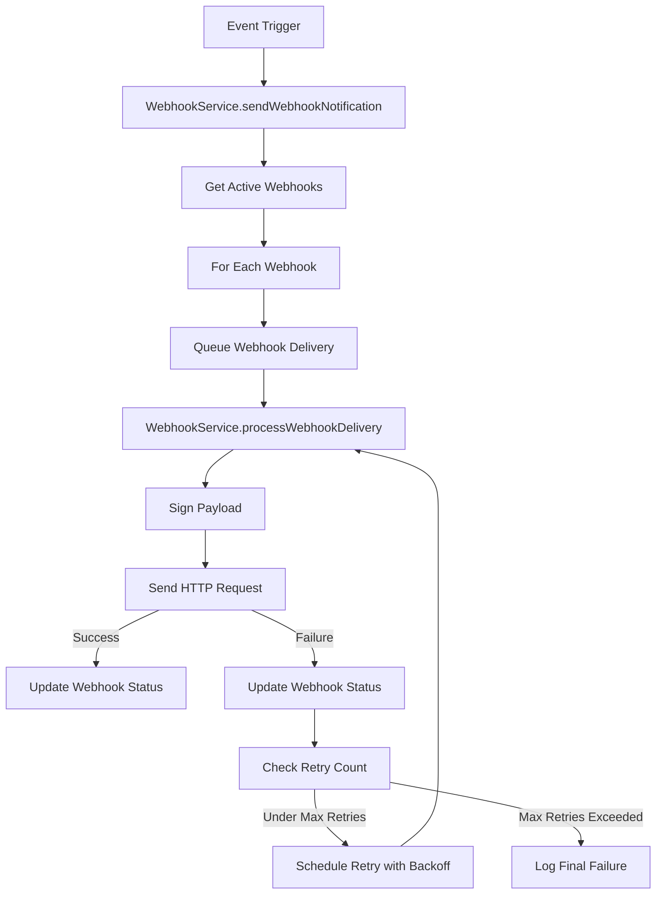

# Crypto Payment Gateway Execution Flow

This document provides a comprehensive view of the application's execution flow, showing how different components interact during runtime.

## Application Initialization Flow

## Payment Processing Flow

## Settlement Flow

## Fallback Mechanism Flow

## Webhook Notification Flow

## Critical Paths and Potential Bottlenecks

1. **Blockchain Interaction**
   - Transaction confirmation checks rely on blockchain RPC availability
   - WebSocket connection for real-time transaction monitoring

2. **Queue Service Reliability**
   - Critical for asynchronous processing of transactions and webhooks
   - Fallback mechanism provides resilience but with potential delays

3. **Database Operations**
   - Heavy reliance on database for transaction and address management
   - Circuit breaker pattern helps prevent cascading failures

4. **External API Calls**
   - Webhook delivery depends on merchant endpoint availability
   - Retry mechanism with exponential backoff helps ensure eventual delivery

## Execution Stack Summary

The application follows a layered architecture with clear separation of concerns:

1. **HTTP API Layer** - Express application handling client requests
2. **Service Layer** - Core business logic in specialized services
3. **Data Access Layer** - Database interactions via TypeORM repositories
4. **External Integration Layer** - Blockchain and webhook interactions

The execution flow is primarily event-driven, with the QueueService providing decoupling between components. The fallback mechanisms ensure the application can continue functioning with degraded capabilities even when external dependencies are unavailable.