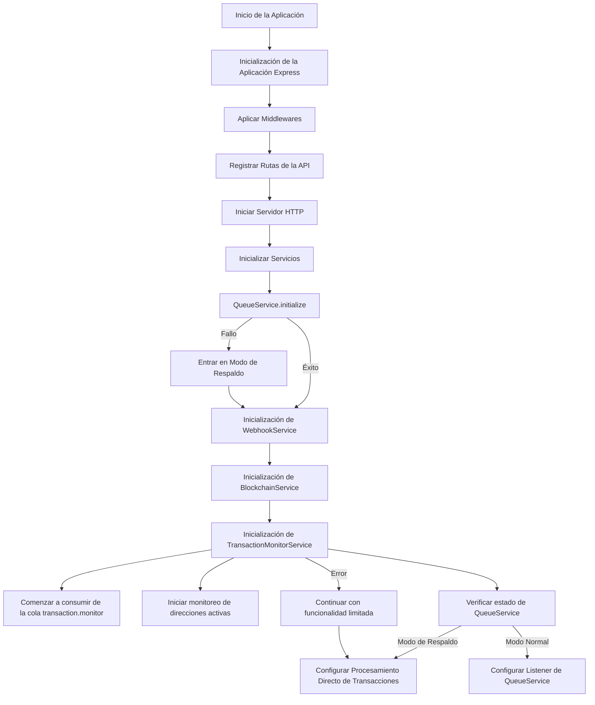
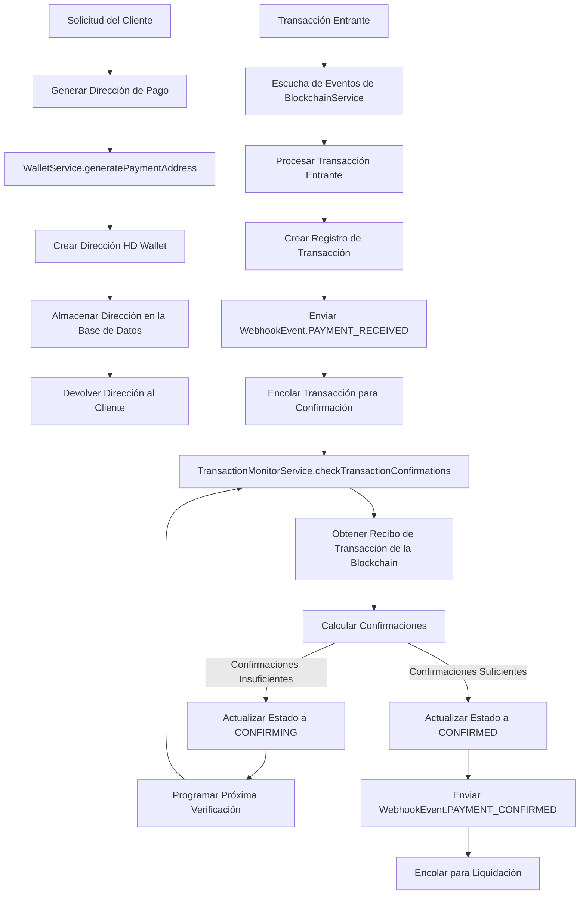
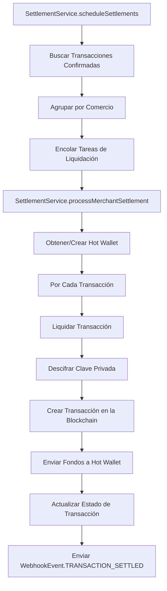
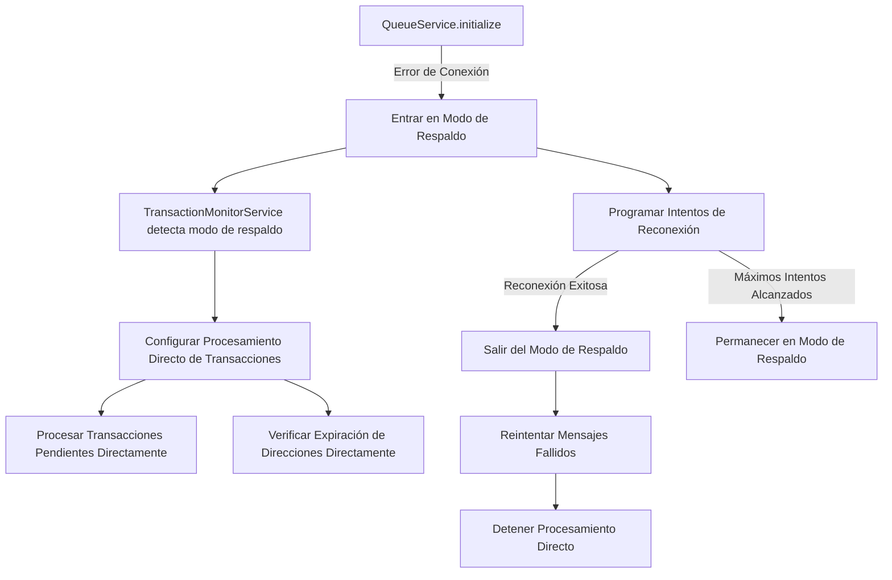
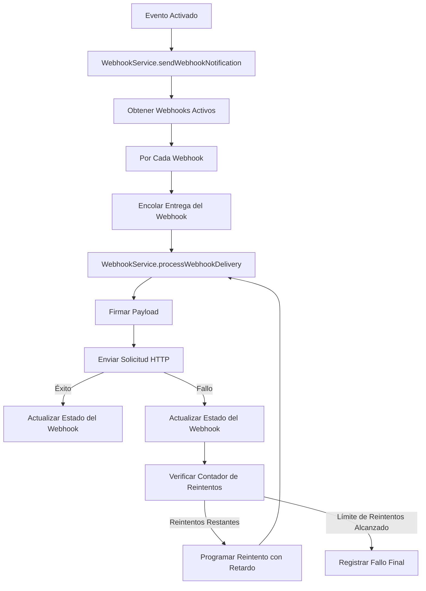

# Flujo de Ejecución de la Pasarela de Pagos Cripto

Este documento proporciona una visión detallada del flujo de ejecución de la aplicación, mostrando cómo interactúan los diferentes componentes durante el tiempo de ejecución.  

## Flujo de Inicialización de la Aplicación

## Flujo de Procesamiento de Pagos

## Flujo de Liquidación

## Flujo del Mecanismo de Respaldo

## Flujo de Notificación Webhook

## Rutas Críticas y Posibles Cuellos de Botella

1. **Interacción con la Blockchain**  
   
   - Las verificaciones de confirmación dependen de la disponibilidad del RPC de la blockchain  
   - Conexión WebSocket para monitoreo en tiempo real  

2. **Fiabilidad del Queue Service**  
   
   - Esencial para el procesamiento asíncrono de transacciones y webhooks  
   - El mecanismo de respaldo brinda resiliencia pero puede introducir retrasos  

3. **Operaciones de Base de Datos**  
   
   - Alta dependencia de la base de datos para gestión de transacciones y direcciones  
   - El patrón *circuit breaker* previene fallos en cascada  

4. **Llamadas a APIs Externas**  
   
   - La entrega de webhooks depende de la disponibilidad de los endpoints del comercio  
   - Mecanismo de reintentos con retroceso exponencial asegura entrega eventual  

## Resumen de la Pila de Ejecución

La aplicación sigue una **arquitectura en capas** con separación clara de responsabilidades:  

1. **Capa de API HTTP** - Aplicación Express que maneja solicitudes  
2. **Capa de Servicios** - Lógica de negocio en servicios especializados  
3. **Capa de Acceso a Datos** - Interacciones con la base de datos mediante TypeORM  
4. **Capa de Integración Externa** - Interacciones con blockchain y webhooks  

El flujo de ejecución es **orientado a eventos**, con QueueService desacoplando componentes. Los mecanismos de respaldo garantizan que la aplicación funcione con capacidades reducidas incluso si hay fallos en dependencias externas.  
